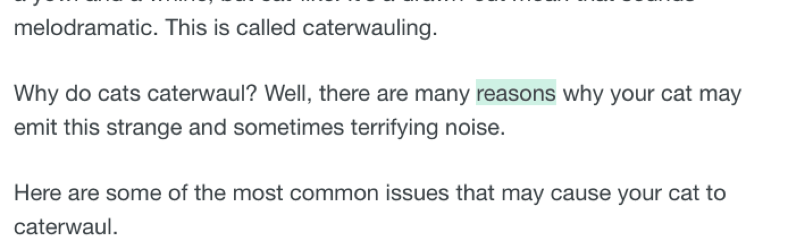

# Web Selection Word

## Background
In the process of browsing English web pages, when the mouse click randomly click words, get the current selected words

## 

## Install
``````
git clone git@github.com:wang90/web-word-selection.git
npm install
npm run build
``````

## Usage
`````
const notClassNames = [];
const body = null;
const hightLignt =  new HightLignt( body, notClassNames);
// 运行
hightLignt.run();
// 获得点击的词语
hightLignt.hook( (word) => {
// console.log(word);
});
`````

## Example
`````
npm run dev
`````


